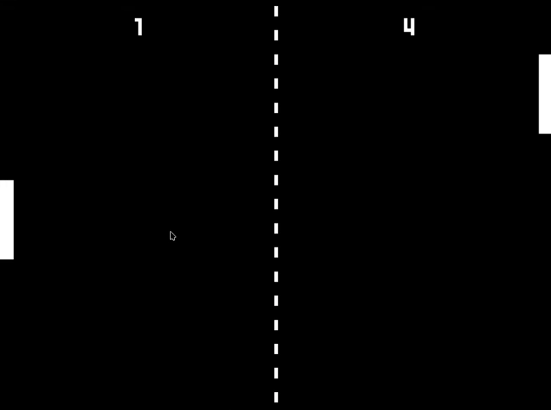

# Pong

This is the game Pong created using the Godot engine as part of the [20 Games Challenge](https://20_games_challenge.gitlab.io/challenge/).

## Controls

| Action             | Key  |
| ------------------ | ---- |
| Player 1 Move Up   | W    |
| Player 1 Move Down | S    |
| Player 2 Move Up   | Up   |
| Player 2 Move Down | Down |

## Credits

### Sound Effects

[Helton Yan](https://heltonyan.itch.io/)
